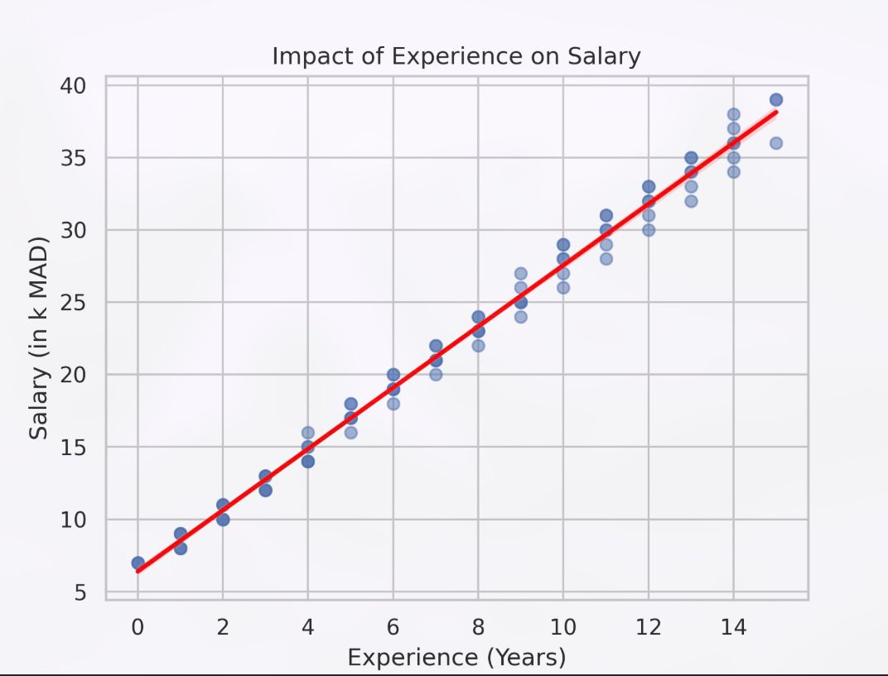
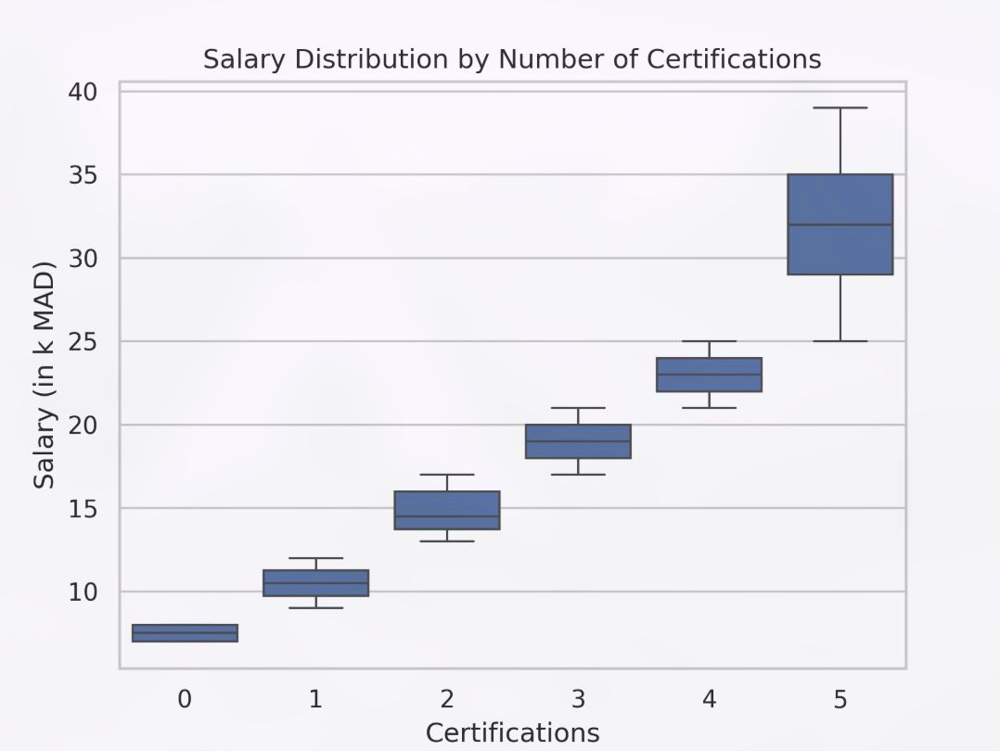
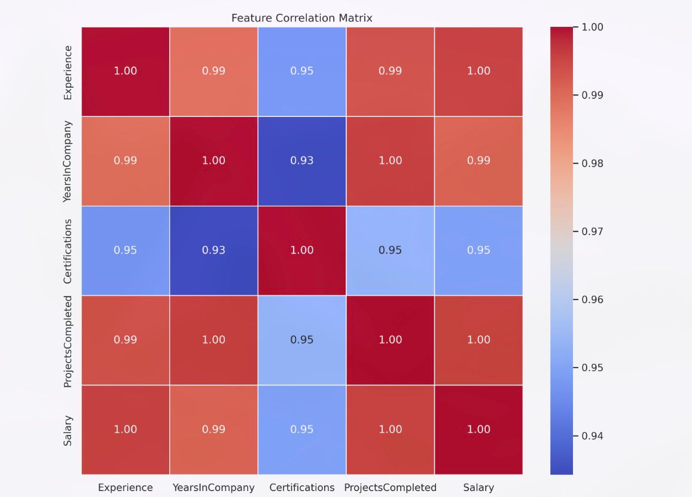
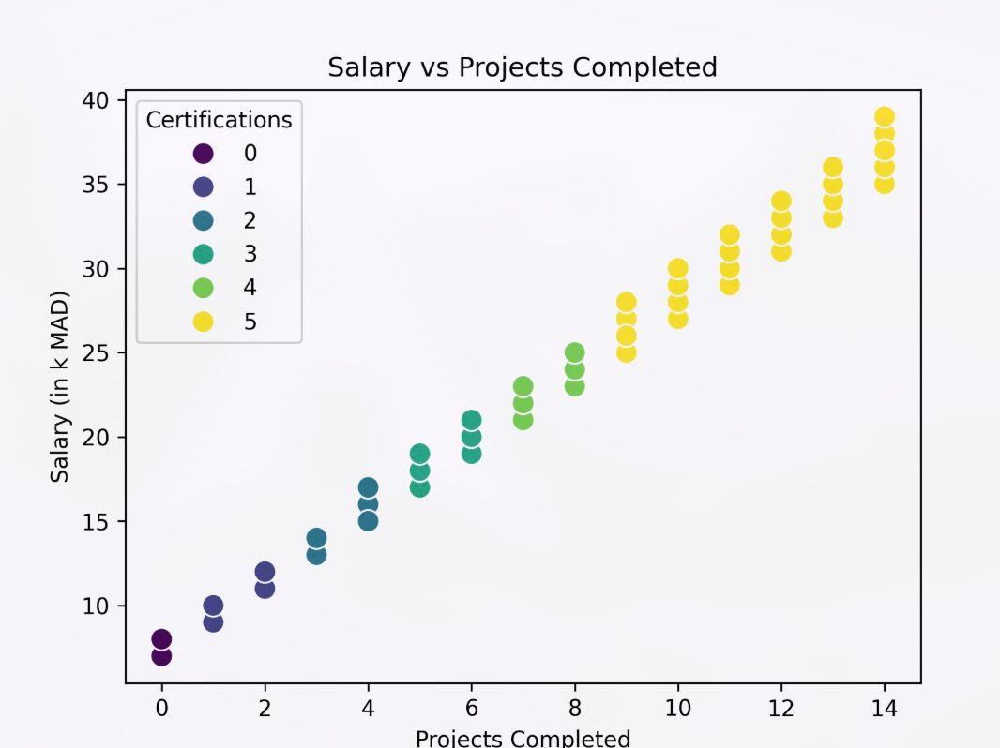

# IT Salary Predictor

A multiple linear regression model built **from scratch using NumPy** to predict IT salaries based on experience, company tenure, certifications, and completed projects — no scikit-learn, pure gradient descent implementation.

---

## Overview

| | |
|---|---|
| **Type** | Supervised Learning — Regression |
| **Algorithm** | Multiple Linear Regression (Gradient Descent) |
| **Dataset** | 90 samples · 4 features |
| **Target** | Salary (k MAD) |
| **R²** | 0.946 |

---

## Project Structure

```
it_salary_predictor/
│
├── model.py               # Core ML: predict, cost function, gradients, gradient descent
├── train.py               # Training pipeline + predictions output
├── predict.py             # Interactive CLI salary prediction tool
├── plot1.py               # Experience vs Salary — regression plot
├── plot2.py               # Salary distribution by certifications — boxplot
├── plot3.py               # Feature correlation heatmap
├── plot4.py               # Salary vs Projects Completed — scatter plot
├── salary_dataset.csv     # Dataset (90 samples)
└── README.md
```

---

## Dataset

The dataset contains **90 IT professional records** with the following features:

| Feature | Description | Range |
|---|---|---|
| `Experience` | Total years of experience | 0 – 15 |
| `YearsInCompany` | Years at current company | 0 – 13 |
| `Certifications` | Number of certifications held | 0 – 5 |
| `ProjectsCompleted` | Number of completed projects | 0 – 14 |
| `Salary` | Monthly salary in k MAD *(target)* | 7 – 39 |

---

## Model

The full linear regression pipeline is implemented from scratch — no ML library.

### Hypothesis

$$\hat{y} = \mathbf{w} \cdot \mathbf{x} + b$$

### Cost Function (MSE)

$$J(w, b) = \frac{1}{2m} \sum_{i=1}^{m} \left( \hat{y}^{(i)} - y^{(i)} \right)^2$$

### Gradient Descent Updates

$$w_j := w_j - \alpha \cdot \frac{\partial J}{\partial w_j} \qquad b := b - \alpha \cdot \frac{\partial J}{\partial b}$$

### Hyperparameters

| Parameter | Value |
|---|---|
| Learning rate `α` | `5e-3` |
| Iterations | `12 000` |
| Initial weights | `[0, 0, 0, 0]` |
| Initial bias | `0` |

---

## Results

Learned parameters after training:

| Parameter | Value |
|---|---|
| `w[Experience]` | `1.1047` |
| `w[YearsInCompany]` | `0.1505` |
| `w[Certifications]` | `0.0954` |
| `w[ProjectsCompleted]` | `0.8518` |
| `b` (bias) | `6.7548` |

`Experience` and `ProjectsCompleted` are the most influential features on salary.

---

## Visualizations

### Experience vs Salary
Linear relationship between years of experience and salary — confirms `Experience` as the dominant predictor.



### Salary Distribution by Certifications
Salary grows consistently with the number of certifications held.



### Feature Correlation Matrix
Strong positive correlations between all features and the target variable.



### Salary vs Projects Completed
Projects completed combined with certifications show a clear upward salary trend.



---

## Installation

```bash
git clone https://github.com/amine-mlops/it_salary_predictor.git
cd it_salary_predictor
pip install -r requirements.txt
```

**Dependencies:** `numpy` · `pandas` · `matplotlib` · `seaborn`

---

## Usage

### Train the model

```bash
python train.py
```

Output: learned weights `w` and bias `b`, plus predictions vs targets for all 90 samples.

### Predict a salary interactively

```bash
python predict.py
```

```
=== Salary prediction tool (K MAD) ===
Years of Experience: 5
Years in Company: 3
Certifications: 2
Projects Completed: 4
------------------------------
Estimated Salary: 14.32 k MAD
------------------------------
```

### Generate visualizations

```bash
python plot1.py   # Experience vs Salary
python plot2.py   # Salary by Certifications
python plot3.py   # Correlation Heatmap
python plot4.py   # Salary vs Projects Completed
```

---

## Author

**Amine El-Baydaouy**
3rd year engineering student — Data Science & AI · ENSAM Rabat
[GitHub](https://github.com/amine-mlops)
